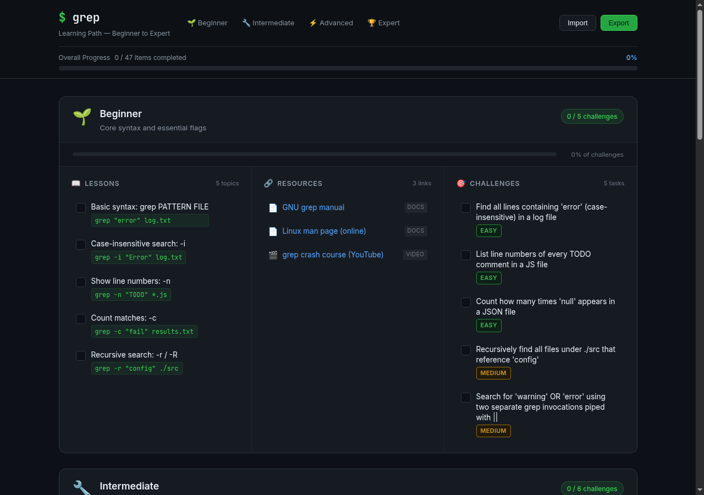

# grep Learning Path

An interactive, self-contained learning path for the `grep` command-line tool — from beginner to expert.



## Features

- **Four progressive stages** — Beginner, Intermediate, Advanced, Expert
- **Per-stage challenge progress bar** and an overall completion bar across all 47 items
- **Curated resources** per stage (docs, articles, videos, interactive tools, books)
- **Challenges with difficulty badges** — easy / medium / hard / expert
- **Import / Export** — save your progress as a JSON file and restore it on any device
- Progress is also auto-saved in `localStorage`

## Usage

Open `index.html` directly in any modern browser — no server, no build step, no dependencies.

```bash
# or serve locally if you prefer
python3 -m http.server 8000
```

## Hosting on GitHub Pages

Push the repository to GitHub and enable Pages (Settings → Pages → Deploy from branch `main`, root `/`). The site will be live at `https://<user>.github.io/<repo>/`.

## Content structure

All learning content lives in `data.js` as a single `stages` array. Each stage object has:

```
lessons    – concepts to check off, each with a one-liner example command
resources  – curated external links tagged by type (docs / article / video / …)
challenges – tasks to complete, each with a difficulty rating
```

To add a lesson, resource, or challenge, edit the relevant stage in `data.js`. IDs must be unique across the whole file (they key into localStorage).

## Progress file format

```json
{
  "version": 1,
  "exportedAt": "2026-05-22T17:00:00.000Z",
  "completedLessons": ["b1", "b2"],
  "completedChallenges": ["bc1"]
}
```
